# Victor

Old mobile phone buying platform

## 📸 ScreenShots

| Light                             | Dark                              |
| --------------------------------- | --------------------------------- |
|   | 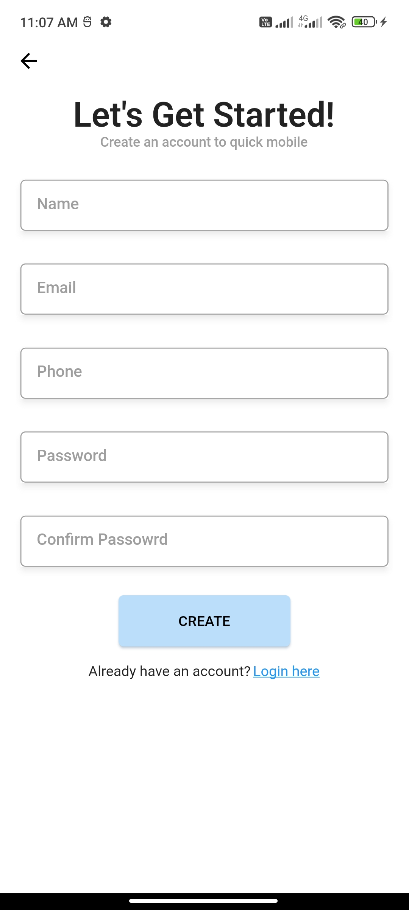  |
| 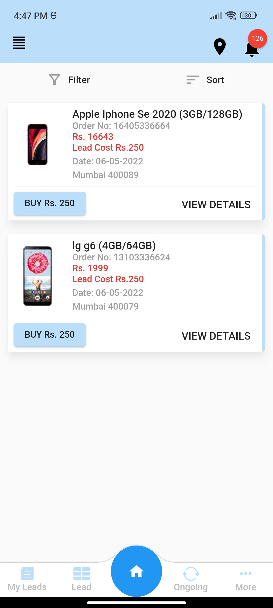  | 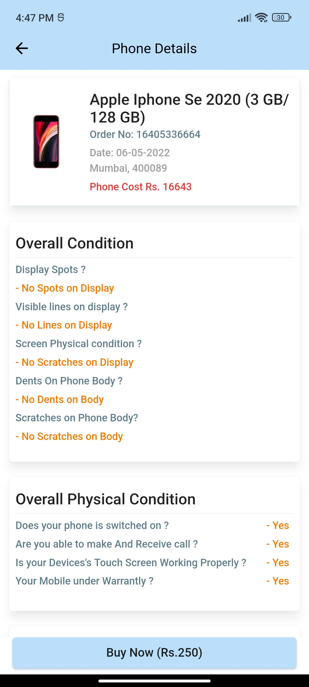  |
| 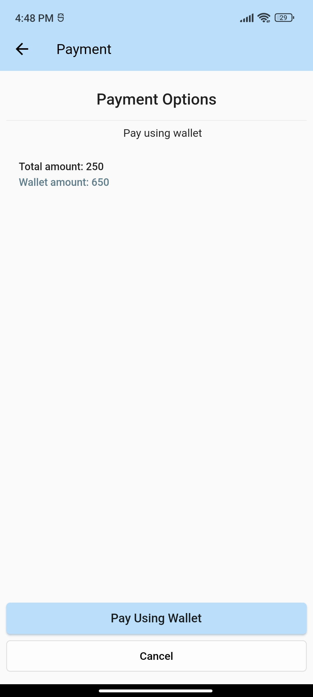  | 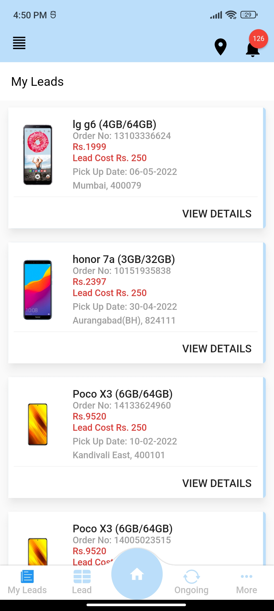  |
| 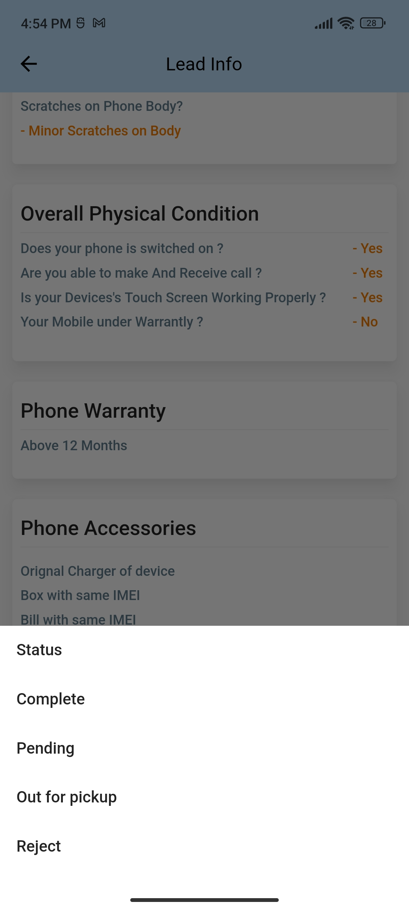  | 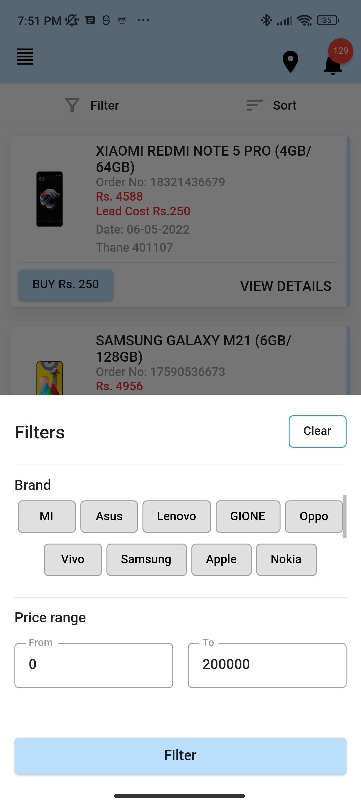  |
| 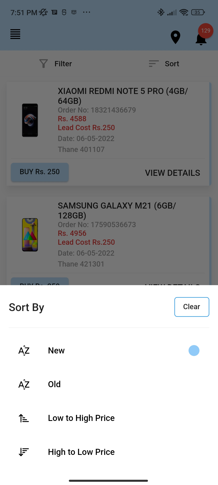  | 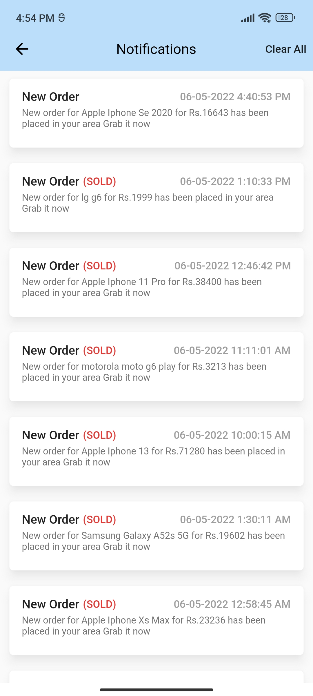 |
| 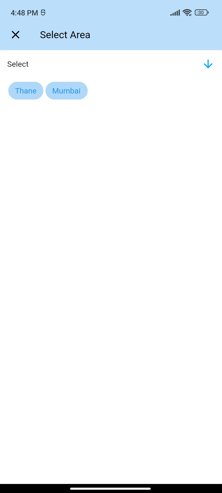 | 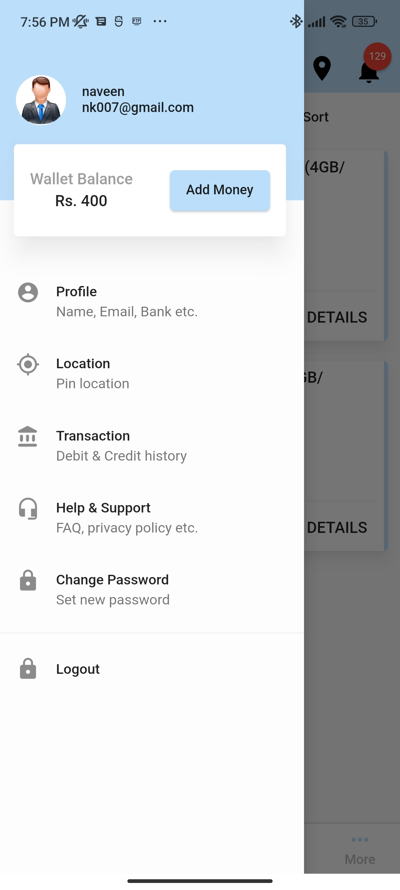 |
| 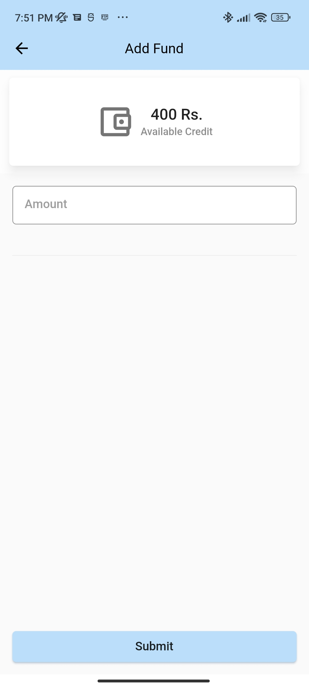 | 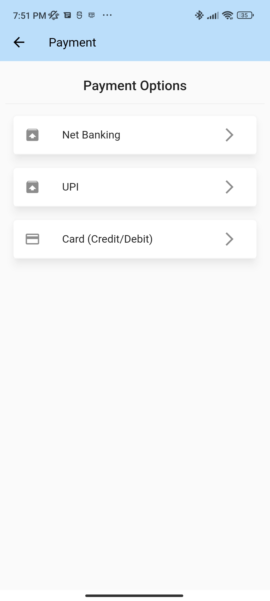 |
| 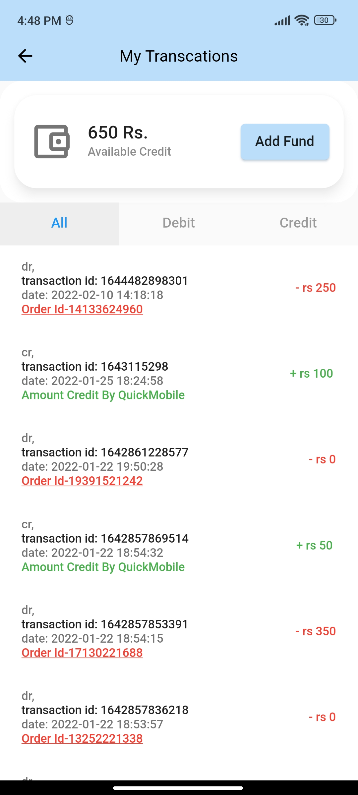 | 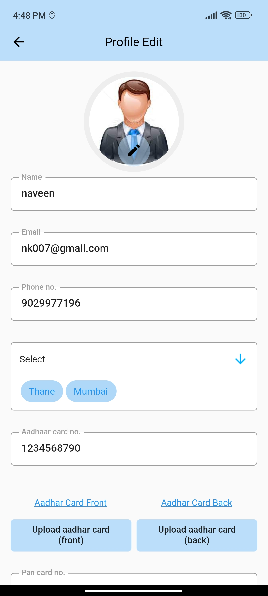 |
| 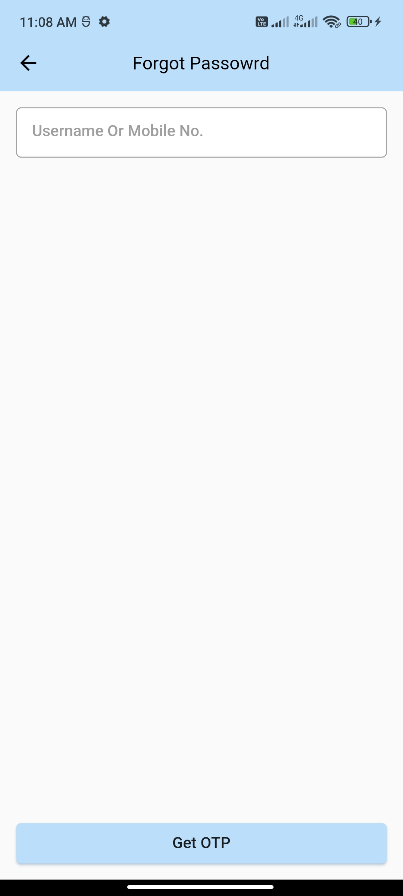 |  |

## 🔌 Plugins

| Name                                                                                    | Usage                           |
| --------------------------------------------------------------------------------------- | ------------------------------- |
| [**getx**](https://pub.dev/packages/get)                                                | State Management                |
| [**http**](https://pub.dev/packages/http)                                               | Get HTTP resources              |
| [**connectivity plus**](https://pub.dev/packages/connectivity_plus)                     | Get network connectivity status |
| [**flutter native splash**](https://pub.dev/packages/flutter_native_splash)             | Create splash screen            |
| [**get storage**](https://pub.dev/packages/get_storage)                                 | Save key-value pair data        |
| [**paytm_allinonesdk**](https://pub.dev/packages/paytm_allinonesdk)                     | payment gatway                  |
| [**paytm_allinonesdk**](https://pub.dev/packages/paytm_allinonesdk)                     | payment gatway                  |
| [**flutter_screenutil**](https://pub.dev/packages/flutter_screenutil)                   | Adapting screen and font size   |
| [**flutter_local_notifications**](https://pub.dev/packages/flutter_local_notifications) | Displaying local notifications  |
| [**firebase_messaging**](https://pub.dev/packages/firebase_messaging)                   | Firebase Cloud Messaging        |
| [**firebase_messaging**](https://pub.dev/packages/firebase_messaging)                   | Firebase Cloud Messaging        |

## 🤓 Author(s)

**Aakash Haribhau Kondhalkar**
