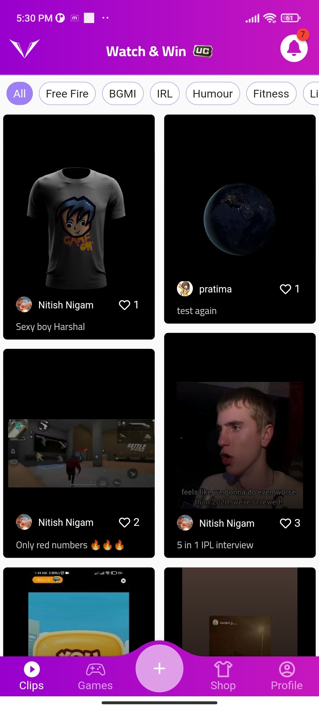
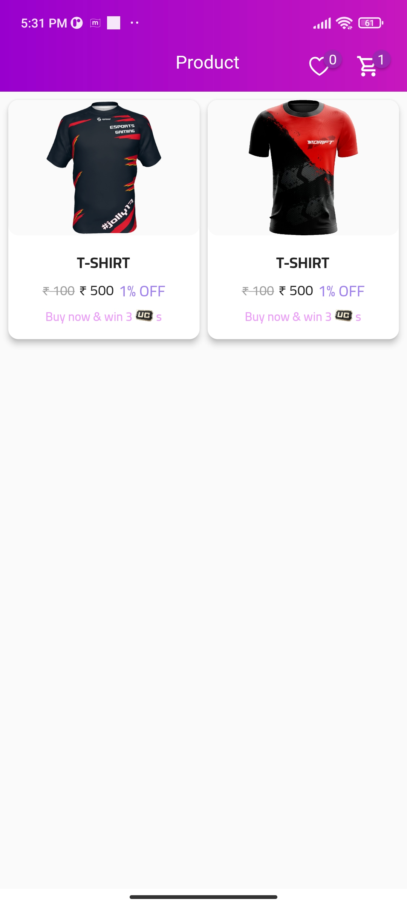
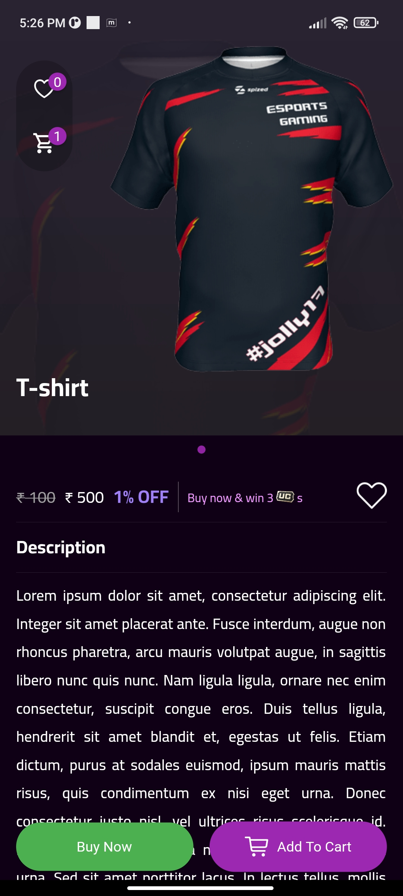

# Victor

Application to play game, upload clips, buy cloths and earn rewards

 

 

## 💻 Requirements

- Any Operating System (ie. MacOS X, Linux, Windows)
- Any IDE with Flutter SDK installed (ie. IntelliJ, Android Studio, VSCode etc)
- A little knowledge of Dart and Flutter
- An account for weather API Goto https://openweathermap.org/, copy api and add to `lib/api_key.dart` file

## ✨ Features

- [x] Search Weather by Country.
- [x] Network status cheking.

## 📸 ScreenShots

| Light                                   | Dark                                   |
| --------------------------------------- | -------------------------------------- |
|   |   |
|   |   |
|   |   |
|   |   |
|   |   |
|   |   |
|   |   |
|   |   |
|   |   |
|  |  |
|  |  |
|  |  |
|  |  |
|  |  |
|  |  |
|  |  |
|  |  |
|  |  |
|  |  |
|  |  |
|  |  |

## 🔌 Plugins

| Name                                                                        | Usage                           |
| --------------------------------------------------------------------------- | ------------------------------- |
| [**getx**](https://pub.dev/packages/get)                                    | State Management                |
| [**http**](https://pub.dev/packages/http)                                   | Get HTTP resources              |
| [**connectivity plus**](https://pub.dev/packages/connectivity_plus)         | Get network connectivity status |
| [**flutter native splash**](https://pub.dev/packages/flutter_native_splash) | Create splash screen            |
| [**get storage**](https://pub.dev/packages/get_storage)                     | Save key-value pair data        |

## 🤓 Author(s)

**Aakash Haribhau Kondhalkar**

## 🔖 LICENCE

[MIT](https://github.com/aakashkondhalkar/flutter_projects/blob/main/climate/LICENSE)
